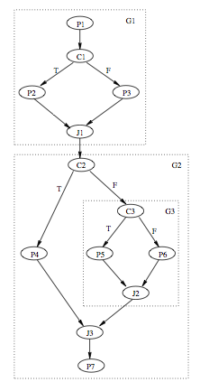
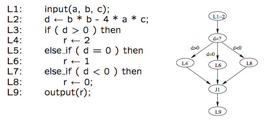
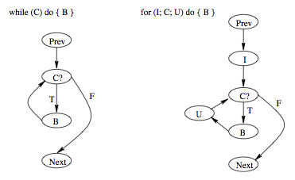
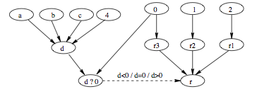
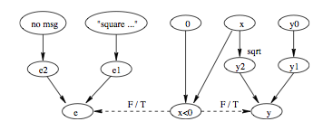
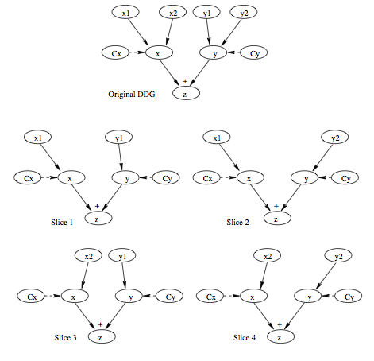
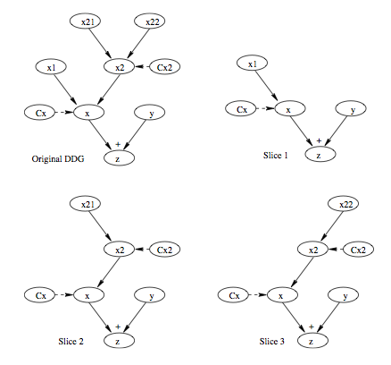

Software Quality Engineering
============================

	Testing, Quality Assurance, and Quantiable Improvement

Tian Siyuan <tiansiyuan@gmail.com>

# Chapter 11. Control Flow, Data Dependency, and Interaction Testing

-	 General Types of Interaction in Execution.
-	 Control Flow Testing (CFT)
-	 Data Dependency Analysis
-	 Data Flow Testing (DFT)

# Extending FSM for Testing

-	 FSMs and extensions:

	- Difficulties with FSMs: state explosion

	  => UBST with Markov-OPs/UMMs

	- FSM Limitation: node/link traversal

	  => other testing for complex interactions

-	 Interactions in program execution:

	- Interaction along the execution paths:

		- path: involving multiple elements/stages
		- later execution affected by earlier stages
		- tested via control flow testing (CFT)
		- control flow graph (CFG) belongs to FSM

	- Computational results affected too

		- data dependency through execution
		- analysis: data dependency graph (DDG)
		- tested via data flow testing (DFT)

# CFGs and FSMs

-	 CFG (control flow graph)

	- Basis for control flow testing (CFT)
	- CFG as specialized FSMs

		- type II: processing & I/O in nodes
		- links: "is-followed-by" relation, some annotated with conditions

-	 CFG elements as FSM elements

	- nodes = states = unit of processing
	- links = transitions = "is-followed-by"
	- link types: unconditional and conditional, latter marked by branching conditions.

# CFG Example

-	 Example: Fig 11.1 (p.177)

	 for a proper structured program (seq. concat. + nesting, no GOTOs)

# CFG: Nodes and Links

-	 Inlink and outlink defined w.r.t a node

-	 Entry/exit/processing nodes

	- Entry (source/initial) nodes
	- Exit (sink/final) nodes
	- Processing nodes

-	 Branching & junction nodes & links

	- Branching/decision/condition nodes

		- multiple outlinks
		- each marked by a specific condition
		- only 1 outlink taken in execution

	- Junction nodes

		- opposite to branching nodes
		- but no need to mark these inlinks
		- only 1 inlink taken in execution

	- 2-way and N-way branching/junction

# CFG for CFT

-	 CFGs for our CFT

	- Separate processing/branching/junction nodes for clarity

	- Sequential nodes: mostly processing

	  => collapsing into one node (larger unit)

	- No parallelism allow

	  (single point of control in all executions)

	- Mostly single-entry/single-exit CFGs
	- Focus: structured programs, : GOTO.

		- GOTOs => ad hoc testing.

-	 Notational conventions:

	- "Pi" for processing node "i"
	- "Ji" for junction node "i"
	- "Ci" for condition/branching node "i"

# CFT Technique

-	 Test preparation

	- Build and verify the model (CFG)
	- Test cases: CFG ) path to follow
	- Outcome checking:

	  what to expect and how to check it

-	 Other steps: Standard (Chapter 7)

	- Test planning & procedure preparation.
	- Execution: normal/failure case handling.
	- Analysis and Followup

-	 Some specific attention in standard steps:

	 Confirmation of outcome and route in analysis and followup.

# CFT: Constructing CFG

-	 Sources for CFG

	- White box: design/code

		- traditional white-box technique

	- Black box: specification

		- structure and relations in specs

-	 Program-derived (white-box) CFGs

	- Processing: assignment and calls
	- Branch statements

		- binary: if-then-else, if-then
		- multi-way: switch-case, cascading if’s.

	- Loop statements (later)
	- composition: concatenating/nesting.
	- structured programming: no GOTOs

		- hierarchical decomposition possible.

	- explicit/implicit entry/exit

# CFT: Constructing WB/CFG

-	 Example: Fig 11.2 (p.179)

	- analyze program code on left
	- derive CFG on right
	- focus on decision and branches

# CFT: Constructing CFG

-	 Specification-derived (black-box) CFGs

	- Node: "do" (enter, calculate, etc.)
	- Branch: "goto/if/when/while/..."
	- Loop: "repeat" (for all, until, etc.)
	- Entry: usually implicit
	- Exit: explicit and implicit
	- External reference as process unit
	- General sequence: "do"...(then)..."do"
	- Example: CFG in Fig 11.2 from external specifications

-	 Comparison to white-box CFGs

	- Implementation independent
	- Generally assume structured programs
	- Other info sources: user-related items

		- usage-scenarios/traces/user-manuals
		- high-level req. and market analyses

# CFT: Path Definition

-	 Test cases: CFG ) path to follow

	- Connecting CFG elements together in paths
	- Define and select paths to cover
	- Sensitize (decide input for) the paths

-	 Path related concepts/definitions:

	- Path: entry to exit via n intermediate links and nodes

	- Path segment or sub-path

	  proper subset of a path.

	- Loop: path or sub-path with 1+ nodes visited 1+ times
	- Testing based on sub-path combinations
	- Loop testing: specialized techniques

# CFT: Path Selection

-	 Path selection (divide & conquer)

	- Path segment definition
	- Sequential concatenation
	- Nesting of segments
	- Unstructured construction: difficult
	- Eliminate unachievable/dead paths

	  (contradictions and correlations)

-	 "Divide": hierarchical decomposition for structured programs

-	 "Conquer": Bottom-up path definition one segment at a time via basic cases for nesting and sequential concatenation

# CFT: Path Selection

-	 Graph G made up of G1 and G2 subgraphs, with M and N branches respectively

	- Subgraph: 1 entry + 1 exit
	- Key decisions at entry points

-	 Path segment composition:

	- Sequential concatenation: G = G1 o G2

		- M x N combined paths.

	- Nesting: G = G1 (G2)

		- M + N - 1 combined paths

-	 Example paths for Fig 11.1 (p.177):

	 	 TT-, TFT, TFF, FT-, FFT, FFF.

# CFT: Sensitization

-	 Path sensitization/realization

	- Logic: constant predicates
	- Algebraic: variable predicates
	- Use simple, obvious test cases
	- Rely on good application knowledge

		- run through first
		- add other cases later

	- Obtain input values (test point)
		- select for non-unique solutions

	- Alternative solutions via DFT later

-	 Trouble sensitize ) check others first

	- Unachievable?
	- Model/specification bugs?
	- Nothing above ) failure.

# CFT: Logic Sensitization

-	 Segment and combination

	- Divide into segments (entry-exit).
	- Examine predicate relations.
	- Uncorrelated: direct combination.
	- Correlated

		- analysis => path elimination
		- combination

-	 Path elimination:

	- Highly correlated

		- identical: direct merge
		- contradictory
		- logic implications

	- Repeat above steps

# CFT: Algebraic Sensitization

-	 Complexity due to dynamic values

	- Symbolic execution
	- Replace conditions in predicates

	  (sensitive to prior path segments?)

	- Then similar to logic sensitization
	- More complex than logical sensitization

-	 Segment and combination

	- Divide into segments (same)
	- Examine variable relation in predicates
	- Uncorrelated: combination (same)
	- Correlated: path elimination then combination using replaced values via symbolic execution

# CFT: Other Steps

-	 Similar to Chapter 7

-	 Execution and followup

	- Path/statement-oriented execution
		- debugger and other tools helpful

	- Followup: coverage and analysis

-	 Outcome prediction and confirmation

	- Test oracle or outcome prediction

		- may use path-specific properties

	- Path confirmation/verification
	- Guard against coincidental correctness
	- Instrumentation may be necessary
	- Automation: dynamic execution path and related tracing

# Loops: What and Why

-	 Loop: What is it?

	- Repetitive or iterative process
	- Graph: a path with one or more nodes visited more than once
	- Appear in many testing models
	- Recursion

-	 Why is it important?

	- Intrinsic complexity

		- coverage: how much?
		- effectiveness concerns (above)

	- Practical evidence: loop defects
	- Usage in other testing.

# Loop Examples

-	 Common loop examples: Fig 11.3 (p.183)

	- left: "while" loops
	- right: "for" loops
	- other (structured) loops can be converted to these loops

# Loop Specification

-	 Deterministic vs. nondeterministic

	- determining \#iterations ahead of time?

-	 Individual loops

	- Loop control: node, predicate, and control variable
	- Loop entry/exit
	- Processing and looping: pre-test, post-test, mixed-test

-	 Combining loops: structured (nesting & concat.) vs. non-structured (goto)

# Loop Testing

-	 Path coverage:

	- All: infeasible for nested loops:

	- Works for i iterations

	  => i+1 iterations most likely fine too

	- Important: how to select?

		- heuristics and concrete measures
		- boundary related problems more likely

-	 Hierarchical modeling/testing:

	- Test loop in isolation first.
	- Collapse loop as a single node in higher level models

	  ~ Other hierarchical testing techniques.

# Critical Values for Loop Testing

-	 General boundary problems

	- Under/over defined problems and closure problems
	- Boundary shift, (cid:6)1 problem
	- Similar to boundary testing (Chapter 9)

-	 Lower bound problems

	- Initialization problem
	- Loop execution problem
	- Other boundary problems

-	 Lower bound test values

	- Bypass, once, twice
	- Min, min + 1, min - 1

# Critical Values for Loop Testing

-	 Upper bound problems

	- Primarily +/-1 problem
	- Capacity problem
	- Other boundary problems

-	 Upper bound test values:

	- Max, max + 1, max - 1;
	- Practicality: avoid max combinations;
	- Testability: adjustable max.
	- Related: capacity/stress testing

# Critical Values for Loop Testing

-	 Other critical values:

	- Typical number ((cid:25) usage-based testing);
	- Implicit looping assumptions in hierarchical models

-	 Generic test cases:

	- Lower bound: alway exists

	  => related critical values.

	- Upper bound: not always exists
		- if so => related critical values
		- if not => related capacity testing

	- Other critical values
	- Level of details to cover in hierarchical modeling/testing

# CFT Usage

-	 As white box testing (more often)

	- Small programs during unit testing
	- Coarse-grain system level model

-	 As black box testing (less often)

	- Model built on specification

		- higher level constraints as specs

	- Overall coverage of functionality
	- Can be used for UBST

-	 Application environment

	- Control flow errors (& decision errors)
	- In combination with other techniques

# CFT: Other Issues

-	 Limit control flow complexity

	- Proper granularity
	- Hierarchical modeling ideas

		- external units/internal blocks

	- Combination with other strategies

		- CFT for frequently-used/critical parts

	- Language/programming methodology
	- Complexity measurement as guidelines

-	 Need automated support

	- Models from specifications/programs
	- Sensitization support | debugging
	- Path verification | tracing

# Dependency vs. Sequencing

-	 Sequencing

	- Represented in CFT "is-followed-by"
	- Implicit: sequential statements
	- Explicit: control statements & calls
	- Apparent dependency

		- order of execution (sequential machine)
		- but must follow that order?

-	 Dependency relations

	- Correct computational result?
	- Correct sequence: dependencies
	- Synchronization
	- Must obey: essential

		- captured by data flow/dependency

	- PL/system imposed: accidental

		- CFT, including loop testing

# Dependency Relations

-	 Convenient but not essential

	- stmts not involving common variables
	- some data relations (later in DFT)
	- intermediate variables

-	 Nonessential iteration/loops

	- most deterministic loops
	- due to language/system limitations
	- example: sum over an array

-	 Essential dependency

	- data in computation must be defined
	- essential loops: most nondeterministic
	- result depends on latest values

# Need for DFT

-	 Need other alternatives to CFT

	- CFT tests sequencing

		- either implemented or perceived

	- Dependency <> sequencing
	- Other technique to test dependency

-	 Data flow testing (DFT)

	- Data dependencies in computation
	- Different models/representations

	  (traditionally/often as augmented CFT)

	- DFT is not untouched data items within a program/module/etc

	- "data flow" may referred to information passed along from one component to another, which is different from DFT

	- Key: dependency (not flow)?

# DFT: Data Operations

-	 Types of data operation/references

	- Definition (write) and use (read).
	- Define: create, initialize, assign

	  (may also include side effect)

	- Use: computational and predicate

	  (referred to as C-use or P-use)

-	 Characteristics of data operations

	- U: nothing change to original, but

		- P-use affects execution path
		- C-use affects computational result

	- D: new (lasting) value
	- Focus on D and related U

# Data Flow or Data Dependencies

-	 Pairwise relations between data operations

	- U-U: no effect or dependency

		- therefore ignore

	- D-U: normal usage case

		- normal DFT

	- D-D: overloading/masking

		- no U in between => problems/defects?

		  (racing conditions, inefficiency, etc.)

		- implicit U: D-U, U-D

		  expand for conditionals/loops

	- U-D: anti-usage

		- substitute/ignore if sequential
		- convert to other cases in loops

-	 Data dependency analysis may detect some problems above immediately

-	 DFT focuses on testing D-U relations

# DDG and DFT

-	 Data dependency graphs (DDGs)

	 Computation result(s) expressed in terms of input variables and constants via intermediate nodes and links.

-	 DFT central steps (test preparation):

	- Build and verify DDGs.
	- Define and select data slices to cover.

	  (Slice: all used to define a data item.)

	- Sensitize data slices.
	- Plan for result checking.

-	 Other steps in DFT can follow standard testing steps for planning and preparation, execution, analysis and followup.

# DDG Elements

-	 Nodes in DDG: data definitions (D)

	- Represent definitions of data items
		- typically variables and constants
		- also functional/structural components

		  e.g., file/record/grouped-data/etc.

	- Input/output/storage/processing nodes.

-	 Links: relating different D-nodes

	- relation: is-used-by (D-U relation)
	- an earlier D is used by a later D

-	 Conditional vs unconditional D’s:

	- unconditional: directly link nodes
	- conditional: use data selectors (later)

# Example DDG Elements

-	 Unconditional definition example

	 Fig 11.4 (p.188) for z   x + y

-	 Conditional definition example

	 Fig 11.5 (p.190) with a data selector node

	- parallel conditional assignment
	- multi-valued data selector predicate
	- match control and data inlink values

# DDG Characteristics and Construction

-	 Characteristics of DDG

	- Multiple inlinks at most non-terminal nodes
	- Focus: output variable(s)

		- usually one or just a few

	- More input variables and constants.
	- "Fan" shape common.
	- Usually more complex than CFG

		- usually contains more information

		  (omit non-essential sequencing info.)

-	 Source of modeling

	- White box: design/code (traditionally)
	- Black box: specification (new usage)
	- Backward data resolution

	  (often used as construction procedure.)

# Building DDG

-	 Overall strategy

	- Backward chaining/resolution
	- Computation flow
		- result backward
		- implementation forward

	- For DDGs based on specifications

-	 Basic steps

	- Identify output variable(s) (OV)
	- Backward chaining to resolve OV
		- variables used in its computation
		- identify D-U relations
		- repeat above steps for other variables
		- until all resolved as input/constants

	- Handling conditional definitions in above.

# Building DDG: An Example

-	 Example: Fig 11.6 (p.192)

	- data selector in Fig 11.5 as start

	  (we did output r and its data selector already in Fig 11.5)

	- identify non-terminal nodes
	- resolve them, until only input/constants left (at top part)

# Building DDG via Code or CFG

-	 Alternative DDG construction strategy:

	- Difficulty with previous strategy

	  => build CFG first and then DDG

	- DDG construction based on code

	  (no need to build CFG first)

-	 Sequential D: y <- rhs

	- y defined by the expression rhs
	- no in a branching statement
	- identify all variables xi’s and constants ci’s in rhs
	- link xi’s and ci’s to y
	- if xi is not an input variable, it will be resolved recursively

# Building DDG via Code or CFG

-	 D in conditional Branches:

	- blockI; if P then A else B

	  with different y definitions for A and B

	- Build sequential subgraph for each branch

		- blockI; A, with output marked as y1,
		- blockI; B, with output marked as y2.

	- Build selector predicate subgraph for P with context blockI; P

	- Selector to select between A/B branch,

		- y in the selector node
		- y1 and y2 as data inlink
		- P as control inlink
		- match control and data inlink values

-	 N-way branch: Similar, but with N-way selectors and corresponding labeling

# Building DDG

-	 Branching with empty "else"

	- Special alert: still two choices

		- one updated, one unchanged

	- Selector still needed

-	 Branching with multiple OVs

	- CFG subgraph for each OV
	- Same control predicated used as inlinks to multiple selectors
	- Example: Fig 11.7 (p.194)

# DFT and Loops

-	 Essential vs nonessential loops:

	- Essential: mostly nondeterministic
	- Nonessential iteration/loops:

		- most deterministic loops
		- due to language/system limitations;
		- example: sum over an array

-	 Loop testing in DFT:

	- Treat loop as a computational node
	- Unfold/unwind once or twice
	- Similar to one or two if’s
	- Test basic data relation

	  but not all (loop) boundary values

# Defining Data Slices

-	 Data slice: data item and all information needed to determine its value
-	 No data selector involved ) 1 slice.
-	 Single data selector

	- n slices for an n-way selector
	- example: Fig 11.8 (p.195)

# Sensitization in DFT

-	 Test one slice at a time:

	- Test cases: (input-variable, value) pairs to compute a slice
	- Combining (sub)slices
	- Focus on variables in tested slice only
	- Use default values for other variables

	  (still need in our sequential machines)

-	 Combining multiple selectors

	- an M-way and an N-way selector
	- independent: not in other’s slice

	  (not used to define each other)

	  - direct combination: M x N slices
	  ~ sequential concatenation in CFG.
	- nesting: M + N (cid:0) 1 combined slices

	  ~ nesting in CFG

# Sensitization in DFT

-	 Example: Fig 11.9 (p.196)

	- independent selectors for x and y
	- 2 x 2 = 4 combined slices

# Sensitization in DFT

-	 Example: Fig 11.10 (p.197)

	- x2-selector nested in x-selector
	- 3 combined selectors

# Sensitization in DFT

-	 Handling correlations/connections in DFT.

-	 Correlations/connections in unconditional definitions

	- Nothing special need to be done
	- Computational results affected by the shared variables and constants
	- Slice selections not affected

-	 Correlations/connections in data selectors

	 ~ correlated CFT conditions
	- Show up in selector control predicates
	- Correlations captured by shared variable and constants in predicate sub-slices
	- Easily detected, and more easily handled than in CFT

# Other Activities in DFT

-	 Default/random value setting

	- Not affecting the slice
	- But may affect other executions
	- DFT slices has better separation and focus than CFT paths
	- Automated support

-	 Outcome prediction:

	 only need relevant variables in the slice.
	 (simpler than CFT!)

-	 Path vs. slice verification:

	 (similar, but more powerful and more work, so more need for automated support).

# DFT vs CFT

-	 Comparing with CFT:

	- Independent models
	- DFT closer to specification

	  (what result, not how to proceed)

	- More complex, and more info.

	  => limit data flow complexity

	- Essential vs. accidental dependencies
	- Loop handling limitations

-	 Combine CFT with DFT

	- Use in hierarchical testing
	- Nesting, inner CFT & outer DFT
	- CFT for loops

	  (then collapse into a single node in DFT)

	- Other combinations to focus on items of concern

# DFT vs Others

-	 Relation to other testing techniques

	- Usage and importance of features

	  => similar to Markov OPs

	- Synchronization (example later) in transaction flow testing (TFT)

	- Compare to I/O relations in BT

	  1 stage vs multiple/different stages

-	 Beyond software testing

	- Data verification/inspection
	- Data flow machines as oracle?
	- DDG in parallel programs/algorithms

		- help parallelize/speed-up tasks

# DFT: Other Issues

-	 Applicability: (in addition to CFT)

	- Synchronization
	- OO systems: abstraction hierarchies
	- Integration testing

		- communication/connections
		- call graphs

-	 Need automated support

	- Graph models from (pseudo)programs
	- Sensitization: default setting, etc.
	- Path/slice verification
	- Execution support

# DFT in Synchronization Testing

-	 Correct output produced:

	- Input and expected output
	- What we did already in DFT

-	 Synchronization of arrivals (timing)

	- Input in different arriving orders
	- Example with two way synchronization

		- nothing arrives => no output
		- one arrives => no output
		- two arrive (3 cases: A-B, B-A, AB)

		  => correct token generated

	- Combination with correct tokens

# DFT: Synchronization Testing

-	 Multi-way synchronization testing

	- similar: correct output and timing
	- more cases: combinatorial explosion
	- solution: simplify via stages

-	 Multi-stage synchronization

	- solves combinatorial explosion problem
	- input grouping possibilities
	- in-group synchronization and then cross-group synchronization
	- example: 4-way synchronization
	- shares idea of hierarchical testing
