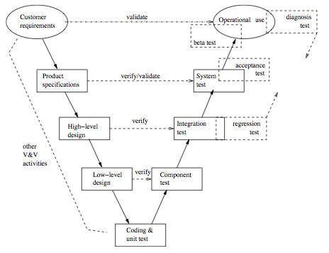
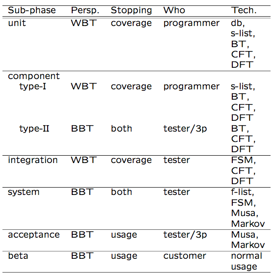
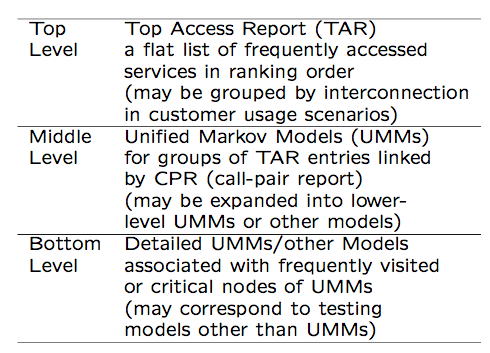

Software Quality Engineering
============================

	Testing, Quality Assurance, and Quantiable Improvement

Tian Siyuan <tiansiyuan@gmail.com>

# Chapter 12. Testing Techniques: Adaptation, Specialization, and Integration

-	Adaptation to Test Sub-phases

-   Specialized Testing Techniques

-   Integration and Web Testing Case Study

# Applications of Testing Techniques

-   Major testing techniques covered so far

    -   Ad hoc (non-systematic) testing
    -   Checklist-based testing
    -   Partition-based coverage testing
    -   Musa’s OP for UBST
    -   Boundary testing (BT)
    -   FSM-based coverage testing
    -   Markov chains and UMMs for UBST
    -   Control flow testing (CFT)
    -	Data flow testing (DFT)

-   Application and adaptation issues

    -   For different purposes/goals
    -   In different environments/sub-phases
    -   Existing techniques: select/adapt
    -	May need new or specialized techniques

# Testing Sub-Phases

-   Annotated V-model for testing sub-phases:

	Fig 12.1 (p.204)

    -	solid box: original sub-phase
    -   dashed box: added sub-phase or specialized testing

# Testing Sub-Phases

-   Original sub-phases in V-model

    -   Operational use (not testing, strictly)
    -   System test for product specification
    -   Integration test for high-level design
    -   Component test for low-level design
    -	Unit test for program code

-   Additional sub-phases/specialized testing

	-	Diagnosis test through all sub-phases

    -   Beta test for limited product release
    -   Acceptance test for product release
    -	Regression test for legacy products

# Unit Testing

-   Key characteristics

    -   Object: unit (implemented code)
	-	function/procedure/subroutine in C, FORTRAN, etc
	-	method in OO languages
    -   Implementation detail => WBT

		(BBT could be used, but less often.)

    -   Exit: coverage (reliability undefined)

-   Commonly used testing techniques

    -	Ad hoc testing
    -   Informal debugging
    -   Input domain partition testing and BT
    -	CFT and DFT

# Component Testing

-   Key characteristics

    -   Object: component (including unit), 2 types
    -	collection of units in C/FORTRAN/etc
		-  	implementation detail => WBT
		
    -  	class in OO languages
		-	reusable component => BBT
		
    -	Exit: coverage (sometimes reliability)

-   Commonly used testing techniques

    -   for traditional systems (component I)

		~ unit testing, but at larger scale

    -   for OOS/COTS/CBSE (component II)

		~ system testing, but at smaller scale
        
      	-    see system testing techniques later

# Integration Testing

-    Key characteristics

     -    Object: interface and interaction among multiple components or subsystems
     -    Component as a black-box (assumed)
     -    System as a white-box (focus)
     -    Exit: coverage (sometimes reliability)

-    Commonly used testing techniques

     -    FSM-based coverage testing
     -    Other techniques may also be used
     -    Sometimes treated as belong to system testing
     
	  => see system testing techniques below

# System Testing

-    Key characteristics

     -    Object: whole system and the overall operations, typically from a customer’s perspective
     -    No implementation detail => BBT
     -    Customer perspective => UBST
     -    Exit: reliability (sometimes coverage)

-    Commonly used testing techniques

     -    UBST with Musa or Markov OPs
     -    High-level functional checklists
     -    High-level FSM, possibly CFT & DFT
     -    Special case: as part of a "super"-system in embedded environment

	  => test interaction with environment

# Acceptance Testing

-    Key characteristics

     -    Object: whole system

          -    but defect fixing no longer allowed

     -    Customer acceptance in the market
     -    Exit: reliability

-    Commonly used testing techniques

     -    Repeated random sampling without defect fixing
     
		(~ assumption for IDRMs, Chapter 22)

     -    UBST with Musa or Markov OPs
     -    External testing services/organizations may be used for system "certification"

# Beta Testing

-    Key characteristics

     -    Object: whole system
     -    Normal usage by customers
     -    Exit: reliability

-    Commonly used testing techniques

     -    Normal usage
     -    Ad hoc testing by customers

	  (trying out different functions/features)

     -    Diagnosis testing by testers/developers to fix problems observed by customers

# Testing Sub-Phases: Comparison

-    Key characteristics for comparison

     -    Object and perspectives
     -    Exit criteria
     -    Who is performing the test
     -    Major types of specific techniques

-    "Who" question not covered earlier

     -    Dual role of programmers as testers in unit testing and component testing I
     -    Customers as testers in beta testing
     -    Professional testers in other sub-phases
     -    Possible 3rd party (IV&V) to test reusable components & system acceptance

# Testing Sub-Phases: Summary

-    Summary: Table 12.1 (p.209)

# Specialized Testing

-    Specialized testing tasks

     -    Some do not fit into specific sub-phases
     -    Different goals (other than reliability)
     -    Non-standard application environment

-    Our coverage

     -    Defect diagnosis testing
     -    Defect-based testing
     -    Regression testing
     -    Testing beyond programs
     -    Testing for other goals/objectives

# Defect Diagnosis Testing

-    Context of defect diagnosis testing

     -    In followup to discovered problems by customers or during testing
     -    Pre-test: understand/recreate problems
     -    Test result: faults located
     -    Followup with fault removal and re-run/re-test to confirm defect fixing

-    Defect diagnosis testing

     -    Typically involve multiple related runs
     -    Problem recreation as the starting point
     -    Perturbation and observation
     -    Domain knowledge important
     -    More recorded defect information

	  	=> less reliance on defect diagnosis

     -    Defect-based techniques (below) useful

# Defect-Based Testing

-    General idea and generic techniques

     -    Focus: discovered or potential defects

	  	(and related areas)

     -    Ad hoc testing based on defect guesses
     -    Risk identification => risk-based testing

	  	(Part IV, especially Chapter 21)

     -    Defect injection and mutation testing

-    Defect injection and testing

     -    Inject known defect (seed known fault)
     -    Test for both seeded and ingenuous faults
     -    Missed faults => testing technique improves
     -    Also used in reliability modeling

-    Mutation testing ~ defect injection testing, but systematic mutants used

# Regression Testing

-    Context of regression testing

     -    In software maintenance and support

          -    ensure change 6) negative impact

     -    In legacy software systems

          -    ensure quality of remaining functions
          -    during development/product update
          -    new part ~ new development
          -    focus: integration sub-phase & after

     -    Re-test to verify defect fixing as well as no unintended consequences

-    Regression testing techniques

     -    Specialized analysis of change: delta-analysis
     -    Focused testing on (new) delta-part
     -    Integration of old and new

# Other Specialized Testing

-    Testing beyond programs

     -    Embedded and heterogeneous systems

          -    test interactions with surroundings

     -    Web testing, in case study later

-    Testing to achieve other goals

     -    Performance testing
     -    Stress testing
     -    Usability testing, etc.

-    Dynamic analysis and related techniques

     -    Simulation to reduce overall cost
     -    Prototyping, particularly in early phases
     -    Timing and sequencing analysis
     -    Event-tree analysis (ETA), Chapter 16

# Test Integration

-    General idea

     -    Many activities and tasks
     -    Different techniques
     -    Individual advantages and limitations
     -    Much commonality exists
     -    Possibility of integration?

-    Test integration: Advantages

     -    combined strength => add benefit
     -    common elements => reduce cost
     -    increase flexibility

# Hierarchical Web Testing

-    Case study from Chapter 10 continued

     -    Web navigation modeled by FSMs
     -    UBST using UMMs to overcome state explosion problem of FSMs
     -    Guiding existing web testing

	 	 (they typically focus on a small unit/facet)

     -    Lack of structure for overall hits

	  	=> use of simplified OPs (Musa OPs)

-    Overall approach

     -    Top-tier: flat (Musa) OP
     -    Middle-tier: UMMs
     -    Bottom-tier: existing web testing

# Existing Web Testing

-    Web functionality testing:

     -    Focus on the web components identified in Chapter 10
     -    HTML syntax checking via various tools
     -    Link checking
     -    Form testing
     -    Verification of end-to-end transactions
     -    Java and other program testing

-    Beyond web functionality testing

     -    Load testing
     -    Usability testing
     -    Browse rendering

# Web Testing 
	From chapter 10

-    Testing web navigations

     -    FSM-based testing in Chapter 10
     -    Web crawling via robots

-    UMMs for web testing (Chapter 10)

     -    Availability/usage of web logs
     -    Some observations

          -    skewed top hit pages and x-references
          -    the impact of structural hierarchy

# Hierarchical Web Testing

-    Overall approach

     -    Top-tier: flat (Musa) OP

          -    for simplicity and skewed distribution

     -    Middle-tier: UMMs

          -    importance of highly used navigations

     -    Bottom-tier: existing web testing

          -    no need to reinvent wheels

-    Implementation support

     -    TAR (top access report) => top-tier
     -    CPR (call-pair report) to form clusters => middle-tier UMMs
     -    UMM refinement => bottom-tier

          -    low-level Markov chains and
          -    traditional (WBT-)testing models

# Hierarchical Web Testing

-    Implementation of the hierarchical web testing strategy: Fig 12.2 (p.218)

