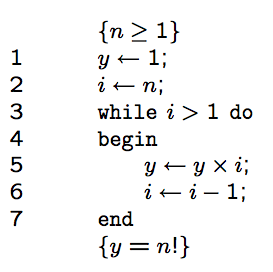
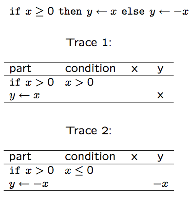

Software Quality Engineering
============================

	Testing, Quality Assurance, and Quantiable Improvement

Tian Siyuan <tiansiyuan@gmail.com>

# Chapter 15. Formal Verification

-	General idea and approaches
-	Axiomatic verification
-	Other approaches
-	Summary and Perspectives

# QA Alternatives

-	Defect and QA

	-	Defect: error/fault/failure
	-	Defect prevention/removal/containment
	-	Map to major QA activities

-	Defect prevention: Error source removal & error blocking
-	Defect removal: Inspection/testing/etc
-	Defect containment: Fault tolerance and failure containment (safety assurance)
-	Special case (this chapter): formal verification (& formal specification)

# QA and Formal Verification

-	Formal methods = formal specification + formal verification
-	Formal specification (FS)

	-	As part of defect prevention
	-	Formal => prevent/reduce defect injection due to imprecision, ambiguity, etc
	-	Briefly covered as related to FV

-	Formal verification (FV)

	-	As part of QA, but focus on positive

		"Prove absence of fault"

	-	People intensive
	-	Several commonly used approaches
	-	Chapter 15 focus on basic ideas

# Formal Specification: Ideas

-	Formal specification

	-	Correctness focus
	-	Different levels of details
	-	3Cs: complete, clear, consistent
	-	Two types: descriptive & behavioral

-	Descriptive formal specifications

	-	Logic: pre-/post-conditions
	-	Math functions
	-	Notations and language support: Z, VDM, etc

-	Behavioral formal specifications: FSM, Petri-Net, etc

# Formal Verification: Ideas

-	"Testing shows the presence of errors, not their absence." -- Dijkstra

-	Formal verification: proof of correctness

	-	Formal specs: as pre/post-conditions
	-	Axioms for components or functional units
	-	Composition (bottom-up, chaining)
	-	Development and verification together

-	Other related approaches

	-	Semi-formal verification
	-	Model checking
	-	Inspection for correctness

# Formal Verification Basics

-	Basic approaches

	-	Floyd/Hoare axiomatic
	-	Dijkstra/Gries weakest precond (WP)
	-	Mills’ prog calculus/functional approach

-	Basis for verification

	-	logic (axiomatic and WP)
	-	mathematical function (Mills)
	-	other formalisms

-	Procedures/steps used

	-	bottom-up (axiomatic)
	-	backward chaining (WP)
	-	forward composition (Mills), etc

# Object and General Approach

-	Basic block: statements

	-	block (begin/end)
	-	concatenation (S1; S2)
	-	conditional (if-then/if-then-else)
	-	loop (while)
	-	assignment

-	Formal verification

	-	rules for above units
	-	composition
	-	connectors (logical consequences)

# Axiomatic Approach

-	Floyd axioms/flowchart

	-	Annotation on flowchart
	-	Logical relations
	-	Verification using logic

-	Hoare axioms/formalization

	-	Pre/Post conditions
	-	Composition (bottom-up)
	-	Loops and functions/parameters
	-	Invariants (loops, functions)
	-	Basis for many later approaches
	-	Focus of Chapter 15

# Axiomatic Correctness

-	Notations

	-	Statements: Si
	-	Logical conditions: fPg etc
	-	Schema: fPg S fQg
	-	Axioms/rules

		
		
-	Axioms

	-	Schema for assignment
	-	Basic statement types
	-	"Connectors"
	-	Loop invariant
	-	Examples in Section 15.2

# Axiomatic Approach: Formal Specs

-	Formal specification

	-	Logical (descriptive) type
	-	Pre-/post-conditions
	-	Pair as specifications at different levels of granularity

-	Example specification for a segment

	-	Input/output variables: x, y
	-	Pre-/post-conditions: P , Q
	-	Pre-condition: non-negative input

		{ P == x >= 0 }

	-	Post-condition: square root computed

		{ Q == y = sqrt(x) }

# Axiomatic Approach: Inference Rules

-	Inference rules: Consequence axioms

	-	Logical implications and deductions
	-	Flexibility for different pre-/post-condition

-	Consequence 1: relaxing post-condition

	

-	Consequence 2: more strict pre-condition

	

	Compare to WP (later)

# Axiomatic Approach: Axioms

-	Assignment schema

	-	Axiom A3: 

	-	where  is derived from P with all free occurrence of y replaced by x

	-	Example: b  <-  b - w with

		- post-condition b >= 0

		  (maintaining non-negative balance)

		- pre-condition is then b - w >= 0

		  or b >= w, sufficient fund for withdraw

-	Axiom A4. Sequential concatenation

	

	Used to build bottom-up proofs

# Axiomatic Approach: Axioms

-	Conditional axioms

-	Conditional 1, if-then-else (Axiom A5)

	

-	Conditional 2, empty else (Axiom A6)

	

# Axiomatic Approach: Axioms

-	Loop type: while cond do something

-	Loop axiom (Axiom A7)

	

-	Specialized techniques for loops

	-	Loop invariant: P (often labeled I)
	-	How to select loop invariant?
	-	Proof of basic loop: Axiom A7

-	Loop termination verification

	-	P positive within a loop
	-	Pi > Pi+1

# Axiomatic Proofs

-	Given: program, pre/post-conditions

-	Basic proof procedure

	-	Add annotations in between statements
	-	Apply axioms to individual statements using assignment schema (A3)
	-	Simple composition (concatenation, A4)
	-	More complex composition

		- if-then-else (A5) and if-then (A6)
		- loop axiom (A7): often the focus

	-	Consequence rules (A1 and A2) as connectors mixed with the above

-	General proof focuses

	-	Loop termination and invariants
	-	Connecting (bottom-up)
	-	Use hierarchical (stepwise abstraction) structure as guide for different parts
		(top-down guide bottom-up procedure)

# Sample Axiomatic Proof

-	Factorial function: Fig 15.1

	-	Pre-cond: { n >= 1 }
	-	Post-cond: { y = n! }

-	Sample axiomatic proof (pp.257-259)

# Sample Axiomatic Proof

-	Key to the proof: loop;

	other steps fairly straightforward

-	Loop invariant I development

	-	y holds partial results ( y = n! / i! )
	-	connection with loop condition i > 1

		=> I == ( y = n! / i! ) ^ ( i >= 1)

	-	resulting in post-condition after loop

		I ^  not B == (y = n!)

-	Observation from sample proof

	proof much longer than the program itself

# Axiomatic Proofs

-	General observations

	-	Many steps involved
	-	Length of proof: An order of magnitude longer than the program
	-	Difficulty with loops

-	Larger/more complex programs

	-	Many elements and (nested!) loops

		=> interaction, coordination

	-	Arrays and functions/procedures

		=> more complicated schemas/axioms

	-	Much harder
	-	Selective verification ideas?

		See Chapter 16, safety assurance part

# WP Approach

-	Dijkstra/Gries approach

	-	Weakest preconditions: wp(S; Q)
	-	Dijkstra model: Predicate transforms 
	-	Gries "Science of Programming" book

-	Similarity to axiomatic approach
	-	Logic based, same annotations
	-	Similar units (axioms)
	-	{P}S{Q} interpreted as P => wp(S; Q)

-	Different procedures

	-	Start with post-condition (output)
	-	Backward chaining of WPs

# Functional Approach

-	Functional approach

	-	Mills’ program calculus
	-	Symbolic execution extensively used
	-	Code reading/chunking/cognition ideas

-	Functional approach elements

	-	Mills box notation
	-	Basic function associated with individual statements
	-	Compositional rules
	-	Forward flow/symbolic execution
	-	Comparison with Dijkstra’s wp

# Functional Approach: Symbolic Execution

-	Symbolic execution (Table 15.1, p.261) for

	

-	Both traces used in verification

	- details in Mills et al. (1987a)

# Formal Verification: Limitations

-	Seven myths (Zelkowitz, 1993)

	-	FM guarantee that software is perfect
	-	They work by proving correctness
	-	Only highly critical system benefits
	-	FM involve complex mathematics
	-	FM increase cost of development
	-	They are incomprehensible to client
	-	Nobody uses them for real projects

-	Refutation/discussion (Zelkowitz, 1993)

-	However, some quantified validity

	=> alternative FV methods

# Other Models/Approaches

-	Making FV more easily/widely usable

-	Other models for formal verification

	-	State machines and model checking
	-	Algebraic data spec/verification
	-	Petri nets, etc
	-	Related checking/proof procedures

-	General assessment

	-	Extension to FM before
	-	More advantages & reduced limitations
	-	Formal analysis vs. verification
	-	May lead to additional automation
	-	Hybrid methods
	-	Adaptation and semi-formal methods

# Formal Verification: Other

-	Algebraic specification/verification
	-	Specify and verify data properties
	-	Behavior specification
	-	Base case
	-	Constructions
	-	Domain/behavior mapping
	-	Use in verification

-	Stack example

	-	newstack
	-	push
	-	pop
	-	Canonical form

# Formal Verification: Other

-	Model checking

	-	Behavioral specification via FSMs
	-	Proposition: property of interest expressed as a suitable formula
	-	Model checker: algorithm/program to check proposition validity

		- Proof: positive result
		- Counterexample: negative result

-	Other approaches and discussions

	-	Algorithm analysis
	-	Petri-net modeling and analysis
	-	Tabular/semi-formal method
	-	Formal inspection based
	-	Limited aspects => easier to perform

# FM: Applications

-	What can be formally verified

	-	Program code
	-	Formal design, documentation, etc
	-	Protocols: timing properties

		- deadlock/starvation/etc

	-	Hardware verification
	-	Distributed program verification
	-	Connected to software process

-	Stepwise refinement/verification process

	-	Design and verification together
	-	Different levels of abstraction
	-	e.g., UNITY system

# Application in Software Safety

-	Leveson approach (Chapter 16)

	-	Focused verification
	-	Driven by hazard analysis
	-	Distributed over development phases
	-	Which FM? as appropriate

-	Other applications

	-	Cleanroom: combination with statistical testing
	-	Yih/Tian: PSC, Chapter 16

# Formal Verification: Summary

-	Basic features

	-	Axioms/rules for all language features
	-	Ignore some practical issues: Size, capacity, side effects, etc.?
	-	Forward/backward/bottom-up procedure
	-	Develop invariants: key, but hard

-	General assessment

	-	Di(cid:14)cult, even on small programs
	-	Very hard to scale up
	-	Inappropriate to non-math. problems
	-	Hard to automate

		- manual process => errors increase

	-	Worthwhile for critical applications

-	Comparison to other QA: Chapter 17
