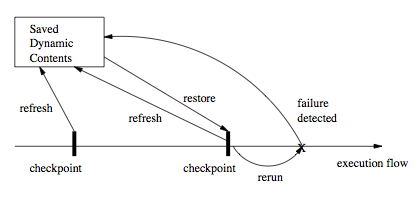
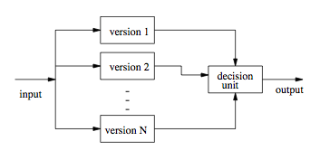
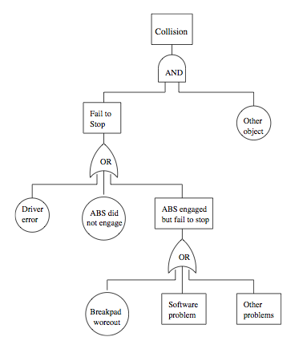
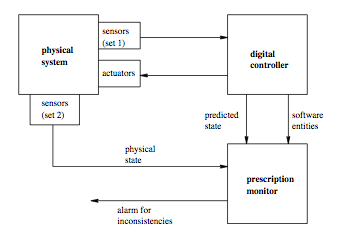

Software Quality Engineering
============================

	Testing, Quality Assurance, and Quantiable Improvement

Tian Siyuan <tiansiyuan@gmail.com>

# Chapter 16. Fault Tolerance and Safety Assurance

-	Basic Concepts
-	Fault Tolerance via RB and NVP
-	Safety Assurance Techniques/Strategies
-	Summary and Perspectives

# QA Alternatives

-	Defect and QA

	-	Defect: error/fault/failure
	-	Defect prevention/removal/containment
	-	Map to major QA activities

-	Defect prevention

	- Error source removal & error blocking

-	Defect removal: Inspection/testing/etc.

-	Defect containment | This Chapter

	-	Fault tolerance

		local faults <> system failures

	-	Safety assurance: contain failures or weaken failure-accident link

# QA and Fault Tolerance

-	Fault tolerance as part of QA

	-	Duplication: over time or components
	-	High cost, high reliability
	-	Run-time/dynamic focus
	-	FT design and implementation
	-	Complementary to other QA activities

-	General idea

	-	Local faults not lead to system failures
	-	Duplication/redundancy used
	-	redo ) recovery block (RB)
	-	parallel redundancy

		=> N version programming (NVP)

-	Key reference (Lyu, 1995b): M.R. Lyu, S/w Fault Tolerance, Wiley, 1995.

# FT: Recovery Blocks

	

-	General idea: Fig 16.1 (p.270)

	-	Periodic checkpointing
	-	Problem detection/acceptance test
	-	Rollback (recovery)

# FT: Recovery Blocks

-	Periodic checkpointing

	-	too often: expensive checkpointing
	-	too rare: expensive recovery
	-	smart/incremental checkpointing

-	Problem detection/acceptance test

	-	exceptions due to in/ex-ternal causes
	-	periodic vs event-triggered

-	Recovery (rollback) from problems

	-	external disturbance: environment?
	-	internal faults: tolerate/correct?

# FT: NVP

-	FT with NVP: Fig 16.2 (p.272)
	-	NVP: N-Version Programming
	-	Multiple independent versions
	-	Dynamic voting/decision ) FT.

# FT: NVP

-	Multiple independent versions

	-	Multiple: parallel vs backup?
	-	How to ensure independence?

-	Support environment

	-	concurrent execution
	-	switching
	-	voting/decision algorithms

-	Correction/recovery?

	-	p-out-of-n reliability
	-	in conjunction with RB
	-	dynamic vs. off-line correction

# FT/NVP: Ensure Independence

-	Ways to ensure independence

	-	People diversity: type, background, training, teams, etc.
	-	Process variations
	-	Technology: methods/tools/PL/etc.
	-	End result/product

		- design diversity: high potential
		- implementation diversity: limited

-	Ways to ensure design diversity

	-	People/teams
	-	Algorithm/language/data structure
	-	Software development methods
	-	Tools and environments
	-	Testing methods and tools (!)
	-	Formal/near-formal specifications

# FT/NVP: Development Process

-	Programming team independence

	-	Assumption: P-team independence

		=> version independence

	-	Maximize P-team isolation/independence
	-	Mandatory rules (DOs & DON’Ts)
	-	Controlled communication (see below)

-	Use of coordination team

	-	1 C-team - n P-teams
	-	Communication via C-team

		- not P-team to P-team
		- protocols and overhead cost

	-	Special training for C-team

-	NVP-specific process modifications

# FT/NVP: Development Phases

-	Pre-process training/organization

-	Requirement/specification phases

	-	NVP process planning
	-	Goals, constraints, and possibilities
	-	Diversity as part of requirement

		- relation to and trade-off with others
		- achievable goals under constraints

	-	Diversity specification
	-	Fault detection/recovery algorithm?

-	Design and coding phases: enforce NVP-process/rules/protocols

# FT/NVP: Development Phases

-	Testing phases

	-	Cross-checking by different versions

		-- free oracle!

	-	Focus on fault detection/removal
	-	Focus on individual versions

-	Evaluation/acceptance phases

	-	How N-versions work together?
	-	Evidence of diversity/independence?
	-	NVP system reliability/dependability?
	-	Modeling/simulation/experiments

-	Operational phase

	-	Monitoring and quality assurance
	-	NVP-process for modification also

# FT and Safety

-	Extending FT idea for safety

	-	FT: tolerate fault
	-	Extend: tolerate failure
	-	Safety: accident free
	-	Weaken error-fault-failure-accident link

-	FT in SSE (software safety engineering)

	-	Too expensive for regular systems
	-	As hazard reduction technique in SSE
	-	Other related SSE techniques

		- general redundancy
		- substitution/choice of modules
		- barriers and locks
		- analysis of FT

# What Is Safety?

-	Safety: The property of being accident-free for (embedded) software systems.

	-	Accident: failures with severe consequences
	-	Hazard: condition for accident
	-	Special case of reliability
	-	Specialized techniques

-	Software safety engineering (SSE)

	-	Hazard identification/analysis techniques
	-	Hazard resolution alternatives
	-	Safety and risk assessment
	-	Qualitative focus
	-	Safety and process improvement

# Safety Analysis & Improvement

-	Hazard analysis

	-	Hazard: condition for accident
	-	Fault trees: (static) logical conditions
	-	Event trees: dynamic sequences
	-	Combined and other analyses
	-	Generally qualitative
	-	Related: accident analysis and risk assessment

-	Hazard resolution

	-	Hazard elimination
	-	Hazard reduction
	-	Hazard control
	-	Related: damage reduction

# Hazard Analysis: FTA

-	Fault tree idea

	-	Top event (accident)
	-	Intermediate events/conditions
	-	Basic or primary events/conditions
	-	Logical connections
	-	Form a tree structure

-	Elements of a fault tree

	-	Nodes: conditions and sub-conditions

		- terminal vs. no terminal

	-	Logical relations among sub-conditions

		- AND, OR, NOT

	-	Other types/extensions possible

# Hazard Analysis: FTA Example

-	Example FTA for an automobile accident (Fig. 16.3, p.276)

# Hazard Analysis: FTA

-	FTA construction

	-	Starts with top event/accident
	-	Decomposition of events or conditions
	-	Stop when further development not required or not possible (atomic)

	-	Focus on controllable events/elements

-	Using FTA

	-	Hazard identification
		- logical composition
		- (vs. temporal composition in ETA)

	-	Hazard resolution (more later)
		- component replacement etc.
		- focused safety verification
		- negate logical relation

# Hazard Analysis: ETA

-	ETA: Why?

	-	FTA: focus on static analysis

		- (static) logical conditions

	-	Dynamic aspect of accidents
	-	Timing and temporal relations
	-	Real-time control systems

-	Search space/strategy concerns

	-	Contrast ETA with FTA
		- FTA: backward search
		- ETA: forward search

	-	May yield different path/info.
	-	ETA provide additional info.

# Hazard Analysis: ETA Example

-	Example ETA for an automobile accident (Fig 16.4, p.277)

-	Compare/contrast with FTA a few slides back

# Hazard Analysis: ETA

-	Event trees

	-	Temporal/cause-effect diagram
	-	(Primary) event and consequences
	-	Stages and (simple) propagation

		- not exact time interval
		- logical stages and decisions

-	Event tree analysis (ETA)

	-	Recreate accident sequence/scenario
	-	Critical path analysis
	-	Used in hazard resolution (more later)

		- esp. in hazard reduction/control
		- e.g. creating barriers
		- isolation and containment

# Hazard Elimination

-	Hazard sources identification => elimination

	(Some specific faults prevented or removed.)

-	Traditional QA (but with hazard focus)

	-	Fault prevention activities

		- education/process/technology/etc
		- formal specification & verification

	-	Fault removal activities

		- rigorous testing/inspection/analyses

-	"Safe" design: More specialized techniques

	-	Substitution, simplification, decoupling
	-	Human error elimination
	-	Hazardous material/conditions#

# Hazard Reduction

-	Hazard identification ) reduction

	(Some specific system failures prevented or tolerated)

-	Traditional QA (but with hazard focus)

	-	Fault tolerance
	-	Other redundancy

-	"Safe" design: More specialized techniques

	-	Creating hazard barriers
	-	Safety margins and safety constraints
	-	Locking devices
	-	Reducing hazard likelihood
	-	Minimizing failure probability
	-	Mostly "passive" or "reactive"

# Hazard Control

-	Hazard identification ) control

	-	Key: failure severity reduction
	-	Post-failure actions
	-	Failure-accident link weakened
	-	Traditional QA: not much, but good design principles may help

-	"Safe" design: More specialized techniques

	-	Isolation and containment
	-	Fail-safe design & hazard scope#
	-	Protection system
	-	More "active" than "passive"
	-	Similar techniques to hazard reduction

		- but focus on post-failure severity decrease vs. pre-failure hazard likelihood decrease

# Accident Analysis & Damage Control

-	Accident analysis

	-	Accident scenario recreation/analysis

		- possible accidents and damage areas
		
	-	Generally simpler than hazard analysis
	-	Based on good domain knowledge

		(not much software specifics involved)

-	Damage reduction or damage control

	-	Post-accident vs. pre-accident hazard resolution
	-	Accident severity reduced
	-	Escape route
	-	Safe abandonment of material/product/etc.
	-	Device for limiting damages

# Software Safety Program (SSP)

-	Leveson’s approach (Leveson, 1995)

	-- Software safety program (SSP)

-	Process and technology integration

	-	Limited goals
	-	Formal verification/inspection based
	-	But restricted to safety risks
	-	Based on hazard analyses results
	-	Safety analysis and hazard resolution
	-	Safety verification

		- few things carried over

-	In overall development process

	-	Safety as part of the requirement
	-	Safety constraints at different levels/phases
	-	Verification/refinement activities
	-	Distribution over the whole process

# Case Study: PSC for CCSCS

-	Object of study and general problems

	-	CCSCS: Computer-controlled safety-critical systems

	-	Problem: Safety and failure damage
	-	(software) reliability models unsuitable

		- assuming large numbers of failures
		- missing damage information

	-	Formal verification

		- static vs. dynamic verification
		- need systematic assertion derivation

-	Prescriptive specification checking

	-	Analyze sources of hazard
	-	Derive systematic assertions
	-	Dynamically check the assertions

# TFM: Two-Frame-Model

-	TFM: Two-Frame-Model

	-	Physical frame
	-	Logical frame
	-	Sensors: physical => logical
	-	Actuators: logical => physical

-	TFM characteristics and comparison
	-	Interaction between the two frames
	-	Nondeterministic state transitions and encoding/decoding functions
	-	Focuses on symmetry/consistency between the two frames

# TFM Example

-	TFM Example: Fig 16.5 (p.280)

	-	physical frame: nuclear reactor
	-	logical frame: computer controller

# Usage of TFM

-	Failure/hazard sources and scenarios

	-	Hardware/equipment failures
	-	Software failures
	-	Communication/interface failures
	-	Focus on last one, based on empirical evidence

-	Causes of communication/interface hazards

	-	Inconsistency between frames.
	-	Sources of inconsistencies
	-	Use of prescriptive specifications (PS)
	-	Automatic checking of PS for hazard prevention

# Frame Inconsistencies

-	System integrity weaknesses: Major sources of frame inconsistencies in CCSCS

-	Discrete vs. continuous

	-	Logical frame: discrete
	-	Physical frame: mostly continuous
	-	Continuous regularity or validity of in-/extrapolation

-	Total vs. partial functions

	-	Logical frame: partial function
	-	Physical frame: total function
	-	) coercion, domain/default specs, etc.

# Frame Inconsistencies (II)

-	Invariants and limits

	-	Logical frame: no intrinsic invariant
	-	Physical frame: intrinsic invariant
	-	Special case: physical limit
	-	) assertions on boundaries/relations as invariants/limits to check

-	Semantic gap

	-	Logical frame: image/map of the reality
	-	Physical frame: physical reality
	-	Syntax vs. semantics in logical frame

-	General solution: to derive systematic assertions for each integrity weakness and automatically/dynamically check them

# Prescriptive Specifications (PS)

-	Definition and examples

	-	Assertion: desired system behavior
	-	Use PS in CCSCS

-	PS for CCSCS

	-	Address integrity weaknesses
	-	Systematic derivation
	-	How to check? dynamic/automatic
	-	Applications in case studies
	-	Effectiveness and completeness

# Deriving Specific PS

-	Domain prescriptions

	-	Address: partial/total function
	-	Boundary: e.g., upper/lower bounds
	-	Type

		- expected ) normal processing
		- unexpected: provide default values or perform exception handling

-	Primitive invariants

	-	Address: lack of intrinsic invariant
	-	Relations based on physical law
	-	Use TFM-based FTA and ETA to identify entities to check
	-	e.g., conservation law

		

# Deriving Specific PS (II)

-	Safety assertions

	-	Address: physical/safety limits
	-	Directly from physical/safety limits
	-	Indirect assertions

		- related program variables
		- based on TFM-based FTA and ETA

-	Image consistency assertions

	-	Address: discrete vs. continuous
	-	State or status checking
	-	Rate checking

# Deriving Specific PS (III)

-	Entity dependency assertions

	-	Address: linkage among components

		(discrete/continuous and semantic gap)

	-	Functional/relational dependencies
	-	Operational characteristics according to physical laws

-	Temporal dependency assertions

	-	Address: temporal relations among components
	
		(discrete/continuous and semantic gap)

	-	Temporal relations/dependencies
	-	Time delay effect according to physical laws
	-	CCSCS are real-time systems

# A Comprehensive Case Study

-	Selecting a case study

	-	Several case studies performed
	-	TMI-2: Three Mile Island accident
	-	Simulator of TMI-2 accident
	-	Seeding and detection of faults

-	A simulator with components

	-	digital controller (pseudo-program chart)
	-	physical system with 4 process variables: power, temp, pressure, water level
	-	introducing prescription monitor

# Prescription Monitor in Case Study

-	Prescription monitor: Fig 16.6 (p.281)

-	Prescription monitor development

	-	performance constraints
	-	quality/reliability of itself?
	-	usage of independent sets of sensors

# Case Study (II)

-	Developing PS in the case study

	-	Generic assertions (domain etc.)
	-	Specific assertions with examples

-	Fault seeding: wide variety of faults

	-	Erroneous input from the user (1-4)
	-	Wrong data types or values (5-7)
	-	Programming errors (8-16)
	-	Wrong reading of sensors (17-19)

-	Result: all detected by prescription monitor by specific PS

# Case Study Summary

-	Prescriptive specification checking

	-	Based on TFM
	-	Analyze system integrity weaknesses
	-	Derive corresponding assertions or PS
	-	Checking PS for hazard prevention
	-	Appears to be effective in several case studies

-	Future directions and development

	-	Apply to realistic applications
	-	Prescription monitor development
	-	Support for PS derivation
	-	Generalization to other systems

		- e.g., embedded systems
		- software-based heterogeneous systems...

# Summary and Perspectives

-	Software fault tolerance

	-	Duplication and redundancy
	-	Techniques: RB, NVP, and variations
	-	Cost and effectiveness concerns

-	SSE: Augment S/W Engineering

	-	Analysis to identify hazard
	-	Design for safety
	-	Safety constraints and verification
	-	Leveson’s s/w safety program, PSC, etc.
	-	Cost and application concerns

-	Comparison to other QA: Chapter 17
