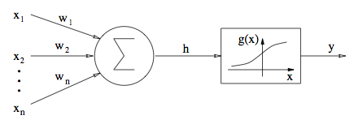
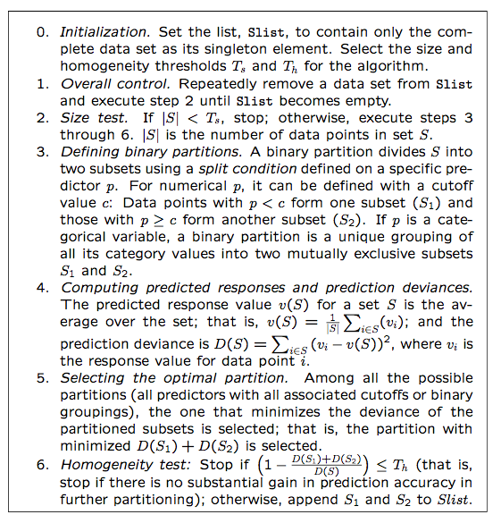
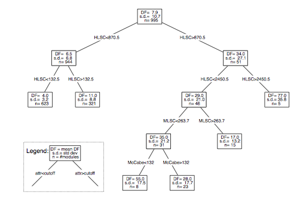
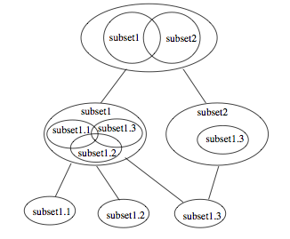
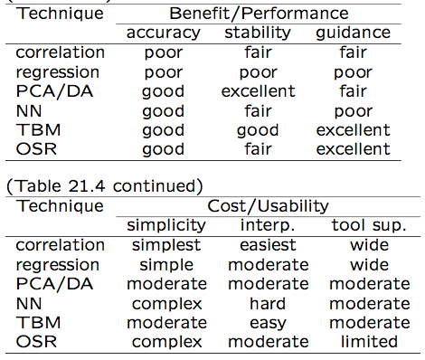
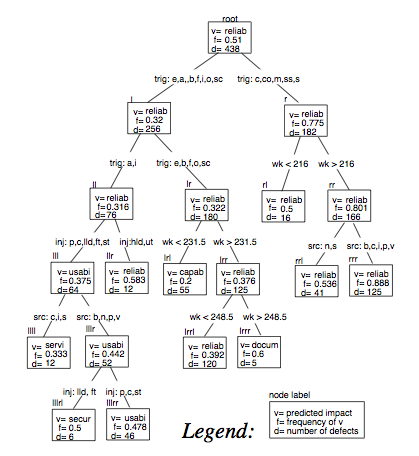

Software Quality Engineering
============================

	Testing, Quality Assurance, and Quantiable Improvement

Tian Siyuan <tiansiyuan@gmail.com>

# Chapter 21. Risk Identification for Quantifiable Quality Improvement

-	Basic Ideas and Concepts
-	Traditional Statistical Techniques
-	Newer/More Effective Techniques
-	Tree-Based Analysis of ODC Data

# Risk Identification: Why?

-	Observations and empirical evidences

	-	80:20 rule: non-uniform distribution

		- 20% of the modules/parts/etc.

		  contribute to

		- 80% of the defects/effort/etc.

	-	implication: non-uniform attention

		- risk identification
		- risk management/resolution

-	Risk Identification in SQE

	-	80:20 rule as implicit hypothesis
	-	focus: techniques and applications

# Risk Identification: How?

-	Qualitative and subjective techniques

	-	Causal analysis
	-	Delphi and other subjective methods

-	Traditional statistical techniques

	-	Correlation analysis
	-	Regression models

		- linear, non-linear, logistic, etc.

-	Newer (more effective) techniques

	-	Statistical: PCA, DA, TBM
	-	AI-based: NN, OSR
	-	Focus of our Chapter.

# Risk Identification: Where?

-	80% or target

	-	Mostly quality or defect

		(most of our examples also)

	-	Effort and other external metrics
	-	Typically directly related to goal
	-	Resultant improvement

-	20% or contributor

	-	20%: risk identification!
	-	Understand the link
	-	Control the contributor

		- corrections/defect removal/etc.
		- future planning/improvement
		- remedial vs preventive actions

# Statistics Basics

-	Random variables

	-	used in statistical analysis/modeling and in risk identification in particular
	-	used as either i.v./p.v. or d.v./r.v.
	-	i.v. or p.v.: independent variable
		- also called predictor (variable)
	-	d.v. or r.v.: dependent variable
		- also called response (variable)

-	Statistical distributions

	-	1d: normal, exponential, binomial, etc.
	-	2d: independent vs. correlated
	-	covariance, correlation (coefficient)

# Traditional Technique: Correlation

-	Correlation coefficient (c.c.)

	-	ranges between -1 and 1
	-	positive: move in same direction
	-	negative: move in opposite direction
	-	0: not correlated (independent)

-	Correlation analysis

	-	use correlation coefficient
	-	linear (Pearson) correlation vs. non-parametric (Spearman) correlation
	-	based on measurement type/distribution

		- non-normal distribution
		- ordinal measurement etc.

-	Correlation analysis: applications

	-	understand general relationship

		- e.g., complexity-defect correlation

	-	risk identification also
	-	cross validation (metrics etc.)

-	Correlation analysis: assessment

	-	only partially successful
	-	low correlation, then what?
	-	data skew: 0-defect example
	-	uniform treatment of data

=> Other risk identification techniques needed.

# Traditional Technique: Regression

-	Regression models

	-	as generalized correlation analysis
	-	n i.v. combined to predict 1 d.v.
	-	forms of prediction formula

		=> diff. types of regression models

-	Types of regression models

	-	linear: linear function

		

	-	log-linear: linear after log-transformation
	-	non-linear: non-linear function
	-	logistic: represent presence/absence of categorical variables

-	Regression analysis: applications

	-	similar to correlation analysis
	-	multiple attribute data

-	Regression analysis: assessment

	-	only partially successful
	-	similar to correlation analysis
	-	often marginally better (R-sqr vs c.c.)
	-	same kind of problems
	-	data transformation problem
	-	synthesized metrics ~ regression model?

=> Other risk identification techniques needed.

# New Techniques

-	New statistical techniques

	-	PCA: principal component analysis
	-	DA: discriminant analysis
	-	TBM: tree-based modeling

-	AI-based new techniques

	-	NN: artificial neural networks.
	-	OSR: optimal set reduction.
	-	Abductive-reasoning, etc.

-	Focus of our Chapter.

# New Techniques: PCA & DA (1)

-	Not really new techniques, but rather new applications in SE.

-	PCA: principal component analysis

	-	Idea of linear transformation.
	-	PCA to reduce dimensionality.
	-	Effectively combined with DA and other techniques (NN later).

-	DA: discriminant analysis

	-	Discriminant function
	-	Risk id as a classification problem
	-	Combine with other techniques

# New Techniques: PCA & DA (2)

-	PCA: why?

	-	Correlated i.v.’s => unstable models
	-	Extreme case: linearly dependent => singularity
	-	linear transformation (PCA) => uncorrelated PCs (or domain metrics)

-	PCA: how?

	-	Covariance matrix: 
	-	Solve  = 0 to obtain eigenvalues (cid:21)j along the diagonal for the diagonal matrix (cid:3)

	-	in decreasing value
	-	Decomposition: 
	-	C: matrix of eigenvectors

	    (transformation used)

# New Techniques: PCA & DA (3)

-	Transformation to PCs/data matrix D

	-	D = ZT , where
	-	Z is the original data matrix
	-	T is the transformation matrix

-	Obtaining PCA results: ; C; T can be calculated by statistical packages/tools.

-	PCA result interpretation/usage

	-	Eigenvalues ~= explained variance.
	-	Uncorrelated PCs 
	
		=> good/stable (linear/other) models

# New Techniques: PCA & DA (4)

-	PCA example: Table 21.1 (p.357)

	

	-	Eigenvalues sorted in decreasing order.
	-	First few (3-5) principal components (PCs) explain most of the variance.
	-	Dimension reduction

		=> simplified models with a few PCs.

# New Techniques: PCA & DA (5)

-	DA: general ideas

	-	Define discriminant function.
	-	Classify into G1 and G2

		- G1: not fault-prune
		- G2: fault-prune

-	Sample discriminant function

	-	Assign di to G1, if ,

	-	Otherwise, assign di to G2.
	-	di: i-th module’s principal-component values (i-th row of the D matrix above).
	-	: prior probability(membership in Gk.
	-	fk(di): probability().

# New Techniques: PCA & DA (6)

-	DA: how?

	-	Discriminant function example above.
	-	Other/similar definitions possible.
	-	Minimize misclassification rate in model fitting and in prediction.
	-	Good results (Khoshgoftaar et al., 1996).

-	PCA&DA: Summary and Observations

	-	Positive/encouraging results, but,
	-	Much processing/transformation needed.
	-	Much statistics knowledge.
	-	Difficulty in data/result interpretation.

# New Technique: NN （1）

-	NN or ANN: artificial neural networks

	-	Inspired by biological computation
	-	Neuron: basic computational unit

		- different functions

	-	Connection: neural network
	-	Input/output/hidden layers

-	NN applications

	-	AI and AI problem solving
	-	In SQE: defect/risk identification

# New Technique: NN （2）

-	Computation at a neuron

	-	Weighted sum of input: 
	
		

		(may include constant)

	-	Then activation function y = g(h)

		- threshold, piecewise-linear,
		- Gaussian, sigmoid (below), etc.

			

-	Illustration: Fig 21.1 (p.358)

	

# New Technique: NN （3）

0. Initialize the weights to small random values.

1. Repeat steps 2 ~ 6 until the error in the output layer is below a pre-specified threshold or a maximum number of iterations is reached.

2. Randomly choose an input.

3. Propagate the signal forward through the network.

4. Compute the errors in the output layer.

5. Compute the deltas for the preceding layers by propagating the errors backward.

6. Update the weights based on these deltas.

-	Overall NN computation: Fig 21.2 (p.359)

	-	input layer: raw data feed
	-	other layers: computation at n neurons
	-	minimize prediction error at the output layer via backward propagation

# New Technique: NN （4）

-	NN study (Khoshgoftaar and Szabo, 1996)

	-	train NN with Kernel.1 data

		- using both raw data and PCA data

	-	apply NN to Kernel.2 and Kernel.3

-	Result comparison: Table 21.2 (p.359)

	-	NN superior to linear regression.
	-	NN+PCA superior to NN on raw data.

	

# New Technique: TBM （1）

-	TBM: tree-based modeling

	-	Similar to decision trees
	-	But data-based (derived from data)
	-	Preserves tree advantages

		- easy to understand/interpret
		- both numerical and categorical data
		- partition => non-uniform treatment

-	TBM applications

	-	Main: defect analysis

		TBDMs (tree-based defect models)

	-	Past: psychology, SE-Amadeus, etc.
	-	Reliability: TBRMs (Ch.22)

-	Risk identification and characterization.

# New Technique: TBM （2）

-	TBM for risk identification

	-	Assumption in traditional techniques

		- linear relation
		- uniformly valid result

	-	Reality of defect distribution

		- isolated pocket
		- different types of metrics
		- correlation/dependency in metrics
		- qualitative differences

	-	Need new risk id. techniques.

-	TBM for risk characterization

	-	Identified, then what?
	-	Result interpretation.
	-	Remedial/corrective actions.
	-	Extrapolation to new product/release.
	-	TBDMs appropriate.

# New Technique: TBM （3）

-	TBDMs: tree-based defect models using tree-based modeling (TBM) technique

-	Decision trees

	-	multiple/multi-stage decisions
	-	may be context-sensitive
	-	natural to the decision process
	-	applications in many problems

		- decision making & problem solving
		- decision analysis/optimization

-	Tree-based models

	-	reverse process of decision trees
	-	data ) tree
	-	idea of decision extraction
	-	generalization of \decision"

# New Technique: TBM （4）

-	Technique: tree-based modeling

	-	Tree: nodes=data-set, edges=decision.
	-	Data attributes

		- 1 response & n predictor variables.

	-	Construction: recursive partitioning

		- with tree growing and pruning.

-	TBM usage: relating r.v. to p.v.

	-	Y = T ree(X1; : : : ; Xn)
	-	understanding vs. predicting
	-	identification and characterization

-	Types of data ) tree type

	-	numerical r.v.: regression tree
	-	categorical r.v.: classification tree

# TBM Algorithm

-	Fig 21.3 (p.360)

	

# TBM Example

-	TBDM example: Fig 21.4 (p.361)

	

	-	defect prediction for IBM-NS
	-	11 design/size/complexity metrics.

	

-	Table 21.3 (p.361): high-risk subsets.

-	Design and control complexity as main predictors to characterize high-risk.

-	Key "selling" points of TBM

	-	intuitiveness and interpretation

		- compare to PCA, NN

	-	quantitative & qualitative info.
	-	hierarchy/importance/organization

# New Technique: OSR （1）

-	OSR: optimal set reduction

	-	pattern matching idea
	-	clusters and cluster analysis
	-	similar to TBM but different in

		- pattern extraction vs. partition

-	algorithm sketch: Fig 21.5 (p.362)

	-	Step 1

			 Both the dependent (response) variable and the explanatory (predictor or independent) variables are discretized by using cluster analysis or some other method if they are continuous.

	-	Step 2

			Select all statistically significant subsets defined by a pattern whose entropy (or uniformity) is within a threshold of the minimal entropy.

	-	Step 3

			Step 2 is repeated until no significant gain can be made in entropy reduction.

# New Technique: OSR （2）

-	OSR illustration: Fig 21.6 (p.363)

	

-	Organization/modeling results

	-	no longer a tree, see example above
	-	general subsets, may overlap
	-	details and some positive results

	see Briand et al. (1992)

# Risk Identification: Comparison

-	Comparison: cost-benefit analysis

	~= comparing QA alternatives (Ch.17).

-	Comparison area: benefit-related

	-	accuracy
	-	early availability and stability
	-	constructive information and guidance for (quality) improvement

-	Comparison area: cost-related

	-	simplicity
	-	ease of result interpretation
	-	availability of tool support

# Comparison: Accuracy

-	Accuracy in assessment

	-	model fits data well

		- use various goodness-of-fit measures

	-	avoid over-fitting
	-	cross validation by review etc.

-	Accuracy in prediction

	-	over-fitting => bad predictions
	-	prediction: training and testing sets

		- within project: jackknife
		- across projects: extrapolate

	-	minimize prediction errors

# Comparison: Usefulness

-	Early availability and stability

	-	to be useful must be available early
	-	focus on control/improvement
	-	apply remedial/preventive actions early
	-	track progress: stability

-	constructive information and guidance

	-	what: assessment/prediction
	-	how to improve?

		- constructive information
		- guidance on what to do

	-	example of TBRMs

# Comparison: Usability

-	Can’t explain in a few words

	=> difficulties with reception/deployment

-	Simplicity & result interpretation?

	-	technique easy to use/understand
	-	what does it (the result) mean?
	-	training effort involved
	-	causal and other connections

-	Tool and other support

	-	availability of easy-to-use tools
	-	other support: process/personnel/etc.
	-	direct impact on deployment

# Comparison Summary

-	Summary: Table 21.4 (p.364)

	

# Recommendations and Integration

-	General recommendations

	-	TBM good balance => prime candidate.
	-	Other techniques might be useful too.
	-	A suite of techniques might be suitable.

-	Lifecycle integration

	-	Process and data availability

		=> inspection/testing/other QA data.

	-	Experience/infrastructure/tools/etc. for implementation/technology transfer.
	-	Similar techniques for other problems

		- e.g., identifying effort, schedule risks.

	-	Tailoring to individual process/product

# Tree-Based ODC Data Analysis

-	Continuation of ODC analysis

	-	IBM Toronto data from ODC (Ch.20)
	-	1-way -> 2-way -> n-way analyses

		- combinatorial explosion

	-	Better focus on n-1 linkage

		- 1 response variable: impact
		- n (=6 here) predictor variables

	-	ODC attributes in Table 20.6 (p.347)

		- all except \severity" used
		- impact-severity analysis already done 
		
		  see Table 20.7 (p.351)

-	Tree-based ODC modeling

	-	Classification trees (instead of regression trees)
	-	Change in distribution

# Tree-Based ODC Data Analysis

-	Overall result: Fig 21.7 (p.366)

	

	- dominant impact shown in tree nodes.

-	Fig 21.8 (p.367): impact distribution

	

	-	Primary partition: defect trigger
	-	High homogeneity of right subtree
	-	Problem identification: left subtree

-	Result interpretation

	-	Overall result: Fig 21.7 (p.366)
	-	Dominant impact: tree nodes.
	-	Impact distribution: bars.
	-	Confidence: frequency and cardinality.

-	Usage of modeling results

	-	Passive tracking and correction
	-	Active problem identification and quality control

-	Other ODC trees possible (for different r.v.)
